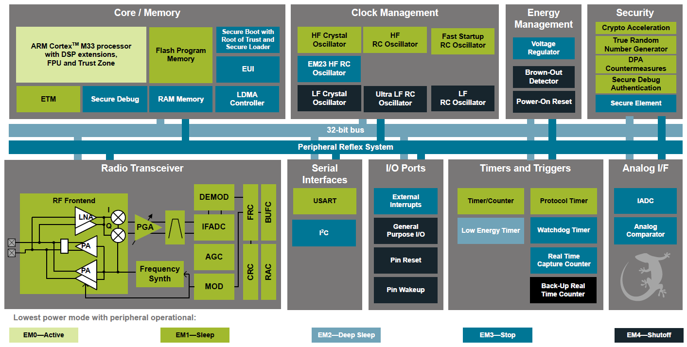
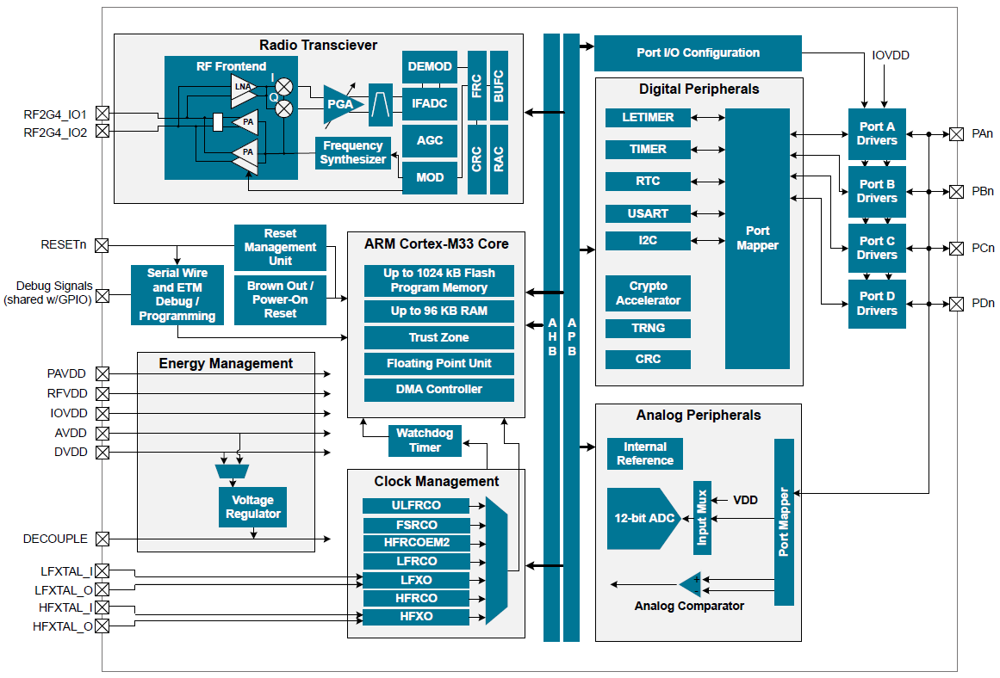

# 【建议使用电脑浏览器访问】

---

# EFR32MG21 Mighty Gecko 多协议无线 SoC 产品系列数据表

Mighty Gecko 多协议 SoC 产品系列是 Wireless Gecko 产品组合的组成部分。Mighty Gecko SoC 是实现 IoT 设备上节能的多协议、多频带连网的理想之选。

这款单芯片解决方案结合了一个 80 MHz ARM Cortex-M33 的内核和一个高性能的 2.4 GHz 无线电收发器，旨在为 IoT 连接应用提供行业领先的、高能效的无线 SoC。

## Mighty Gecko 的应用包括：

- IoT 多协议设备
- 照明
- 联网家庭
- 网关和数字助手
- 建筑自动化及安全

## 主要特点

- 32 位 ARM® Cortex®-M33 内核，最高工作频率为 80 MHz
- 高达 1024 kB flash 和 96 kB RAM
- 12 通道的外围设备反射系统，可实现 MCU 外围设备的自主交互
- 集成 PA，发射功率高达 20 dBm (2.4 GHz)
- 强大的外围设备，4x4 的 QFN 封装内有多达 20 个 GPIO

# 1. 功能列表

EFR32MG21 突出的功能如下。

- **低功耗无线片上系统**
    - 高性能 32 位 80 MHz ARM Cortex®-M33 内核，带有 DSP 指令和浮点单元，可实现高效的信号处理
    - 高达 1024 kB 的 flash
    - 高达 96 kB 的 RAM
    - 2.4 GHz 无线电操作
    - 发射功率高达 20 dBm

- **低能耗**
    - 在 2.4 GHz (1 Mbps GFSK) 的条件下，接收电流为 8.8 mA
    - 在 2.4 GHz (250 kbps O-QPSK DSSS) 的条件下，接收电流为 9.4 mA
    - 在 2.4 GHz 的条件下，0 dBm 输出功率下的发射电流为 9.3 mA
    - 在 2.4 GHz 的条件下，10 dBm 输出功率下的发射电流为 33.8 mA
    - 在活动模式 (EM0) 下，功耗为 50.9 μA/MHz
    - 在 EM2 深度睡眠（保留 96 kB RAM，RTC 从 LFXO 中运行）时，电流为 5.0 μA
    - 在 EM2 深度睡眠（保留 16 kB RAM，RTC 从 LFRCO 中运行）时，电流为 4.5 μA

- **接收器性能高**
    - 在 250 kbps O-QPSK DSSS 的条件下，灵敏度为 -104.5 dBm
    - 在 1 Mbit/s GFSK 的条件下，灵敏度为 -97.5 dBm
    - 在 2 Mbit/s GFSK 的条件下，灵敏度为 -94.4 dBm
    - 在 125 kbps GFSK 的条件下，灵敏度为 -104.9 dBm

- **支持的调制格式**
    - GFSK
    - OQPSK

- **协议支持**
    - Bluetooth 低能耗 (Bluetooth 5)
    - ZigBee
    - Thread

- **丰富的 MCU 外围设备选择**
    - 12 位 1 Msps SAR 模拟数字转换器 (ADC)
    - 2 个模拟比较器 (ACMP)
    - 高达 20 个带有输出状态保持和异步中断功能的通用 I/O 引脚
    - 8 通道的 DMA 控制器
    - 12 通道的外围设备反射系统 (PRS)
    - 2 个 16 位定时器/计数器
        - 3 个比较/捕获/PWM 通道
    - 1 个 32 位定时器/计数器
        - 3 个比较/捕获/PWM 通道
    - 32 位的实时计数器
    - 24 位的低能耗定时器，用于波形生成
    - 2 个看门狗定时器
    - 3 个通用同步/异步接收器/传输器 (UART/SPI/SmartCard (ISO 7816)/ IrDA/I2S)
    - 2 个 I2C 接口，带 SMBus 支持

- **宽工作范围**
    - 单电源 1.71 至 3.8 V
    - -40 至 125 °C 环境温度

- **安全性**
    - 通过 Root of Trust and Seceure Loader (RTSL) 进行的安全启动
    - 通过 DPA 对策实现的硬件加密加速，用于 AES128/256、SHA-1、SHA-2（高达 256 位）、ECC（高达 256 位）、ECDSA、ECDH 和J-Pake
    - 符合 NIST SP800-90 和 AIS-31 标准的真随机数生成器 (TRNG)
    - ARM® TrustZone®
    - 安全调试，带有锁定/解锁功能

- **QFN32 4x4 mm 封装**
    - 0.4 mm 间距

# 2. 订货信息

| 订货代码                  | 协议栈                                        | 最大发射功率      | Flash (kB) | RAM (kB) | 安全            | GPIO | 封装  |
|--------------------------|-----------------------------------------------|------------------|------------|----------|----------------|------|-------|
| EFR32MG21A010F1024IM32-B | • Bluetooth 5.1  • Zigbee  • Thread | 10 dBm @ 2.4 GHz | 1024       | 96       | Secure Element | 20   | QFN32 |
| EFR32MG21A010F512IM32-B  | • Bluetooth 5.1  • Zigbee  • Thread | 10 dBm @ 2.4 GHz | 512        | 64       | Secure Element | 20   | QFN32 |
| EFR32MG21A010F768IM32-B  | • Bluetooth 5.1  • Zigbee  • Thread | 10 dBm @ 2.4 GHz | 768        | 64       | Secure Element | 20   | QFN32 |
| EFR32MG21A020F1024IM32-B | • Bluetooth 5.1  • Zigbee  • Thread | 20 dBm @ 2.4 GHz | 1024       | 96       | Secure Element | 20   | QFN32 |
| EFR32MG21A020F512IM32-B  | • Bluetooth 5.1  • Zigbee  • Thread | 20 dBm @ 2.4 GHz | 512        | 64       | Secure Element | 20   | QFN32 |
| EFR32MG21A020F768IM32-B  | • Bluetooth 5.1  • Zigbee  • Thread | 20 dBm @ 2.4 GHz | 768        | 64       | Secure Element | 20   | QFN32 |

# 3. 系统概述

## 3.1 介绍

## 3.2 无线电

EFR32MG21 Mighty Gecko 具有高度可配置的无线电收发器，支持 ZigBee、Thread 和蓝牙低功耗无线协议。
