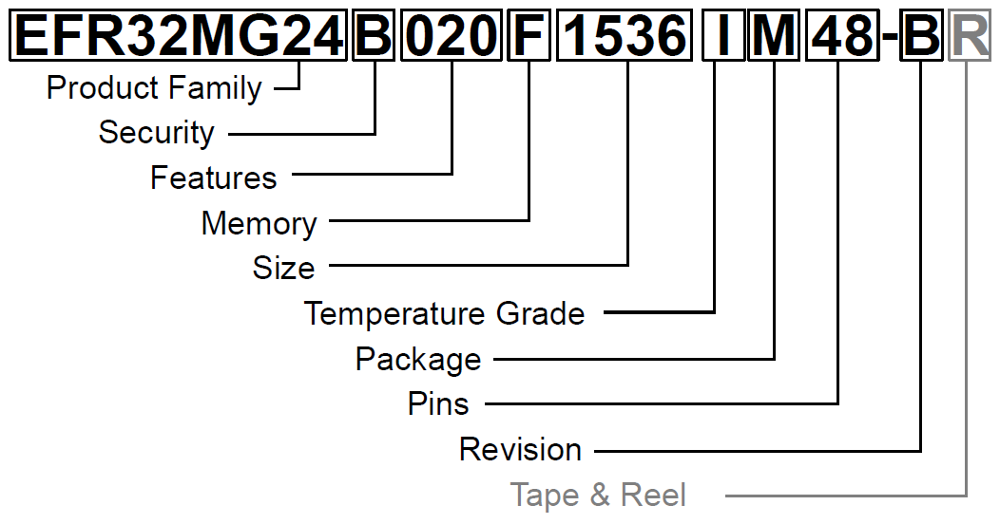

# 【建议使用电脑浏览器访问】

---

# EFR32MG24 无线 SoC 产品系列数据表

EFR32MG24 无线 SoC 是使用 Matter、OpenThread 和 Zigbee 进行网状物联网无线连接的理想选择。

借助高性能的 2.4 GHz 射频、低电流消耗、人工智能 (AI)/机器学习 (ML) 硬件加速器和 Secure Vault 等关键功能，物联网设备制造商可以打造智能、强健、节能的产品，且能够避免远程和本地网络攻击。工作频率高达 78.0 MHz 的 Cortex®-M33 的内核、高达 1536 kB 的 flash 和高达 256 kB 的 RAM，可为严苛的应用提供资源，同时为未来的增长留出空间。

## 目标应用包括：
- 智能家居 - 网关和集线器、传感器、开关、门锁、智能插座
- 照明 - LED 灯泡、灯具
- 楼宇自动化 - 网关、传感器、开关、定位服务
- AI/ML - 预测性维护、玻璃破裂检测、唤醒词检测

## 主要特点

- 32 位 ARM® Cortex®-M33 内核，最高工作频率为 78.0 MHz
- 高达 1536 kB 闪存和 256 kB RAM
- 高性能无线电，输出功率高达 +19.5 dBm
- 节能设计，使得活动和睡眠情况下都能有低电流
- 安全库™
- AI/ML 硬件加速器

# 1. 功能列表

EFR32MG24 的突出功能如下。

- **低功耗无线片上系统**
    - 高性能 32 位 78.0 MHz ARM Cortex®-M33 内核 ，带有 DSP 指令和浮点单元，可实现高效的信号处理
    - 高达 1536 kB 的 flash
    - 高达 256 kB 的 RAM
    - 2.4 GHz 无线电操作
    - 矩阵矢量处理器，可实现 AI/ML 加速

- **射频性能**
    - 在 250 kbps O-QPSK 的条件下，灵敏度为 -105.4 dBm
    - 在 125 kbps GFSK 的条件下，灵敏度为 -105.7 dBm
    - 在 1 Mbps GFSK 的条件下，灵敏度为 -97.6 dBm
    - 在 2 Mbps GFSK 的条件下，灵敏度为 -94.8 dBm
    - 发射功率高达 19.5 dBm

- **低系统能耗**
    - 在 1 Mbps GFSK 的条件下，接收电流为 4.4 mA
    - 在 250 kbps O-QPSK DSSS 的条件下，接收电流为 5.1 mA
    - 在 0 dBm 输出功率的条件下，发射电流为 5 mA
    - 在 10 dBm 输出功率的条件下，发射电流为 19.1 mA
    - 在 19.5 dBm 输出功率的条件下，发射电流为 156.8 mA
    - 频率为 39.0 MHz 时，在活动模式 (EM0) 下的电流消耗为 33.4 μA/MHz
    - 在 EM2 深度睡眠模式下，电流为 1.3 μA（保留 16 kB RAM，RTC 从 LFRCO 中运行）

- **支持的调制格式**
    - 2 (G)FSK，可配置完整波形
    - OQPSK DSSS
    - (G)MSK

- **协议支持**
    - Matter
    - OpenThread
    - ZigBee
    - Bluetooth 低功耗 (BLE 5.3)
    - Bluetooth 网状网络
    - 专有 2.4 GHz
    - 多协议

- **安全库**
    - 硬件加密加速，可用于 AES128/192/256、ChaCha20-Poly1305、SHA-1、SHA-2/256/384/512、ECDSA+ECDH（P-192、P-256、P-384、P-521）、Ed25519 与 Curve25519、J-PAKE、PBKDF2
    - 真随机数生成器 (TRNG)
    - ARM® TrustZone®
    - 安全启动（Root of Trust Seceure Loader）
    - 安全调试解锁
    - DPA 对策
    - 使用 PUF 进行安全密钥管理
    - 防篡改
    - 安全认证

- **丰富的 MCU 外围设备选择**
    - 模数转换器 (IADC)
		- 12 位，1 Msps；或 16 位，76.9 ksps
		- 特定 OPN 支持高速模式（高达 2 Msps）和高精度模式（高达 16 位 ENOB，3.8 ksps）
    - 2 个模拟比较器 (ACMP)
    - 2 个数模转换器 (VDAC)
    - 多达 32 个带有输出状态保持和异步中断功能的通用 I/O 引脚
    - 8 通道 DMA 控制器 (LDMA)
    - 16 通道外围设备反射系统 (PRS)
    - 3 个 16 位定时器/计数器，带 3 个比较/捕获/PWM 通道 (TIMER2/3/4)
    - 2 个 32 位定时器/计数器，带 3 个比较/捕获/PWM 通道 (TIMER0/1)
    - 2 个 32 位实时计数器 (SYSRTC/BURTC)
    - 24 位低能耗定时器，用于波形生成 (LETIMER)
    - 16 位脉冲计数器，带有异步操作 (PCNT)
    - 2 个看门狗定时器 (WDOG)
    - 1 个通用同步/异步接收器/发射器 (USART)，支持 UART/SPI/SmartCard (ISO 7816)/IrDA/I 2S
    - 2 个增强型通用同步/异步接收器/发射器 (EUSART)，支持 UART/SPI/DALI/IrDA
    - 2 个 I2C 接口，支持 SMBus
    - 具有精密模式的低频 RC 振荡器，可以取代 32 KHz 的睡眠晶振 (LFRCO)
    - 小键盘扫描仪，支持最大 6x8 的矩阵 (KEYSCAN)
    - 芯片温度传感器，单点校准后具有 +/-1.5 °C 精度

- **宽工作范围**
    - 1.71 V 至 3.8 V 单电源
    - -40 °C 至 125 °C

- **封装**
    - QFN40 5 毫米 × 5 毫米 × 0.85 毫米
    - QFN48 6 毫米 × 6 毫米 × 0.85 毫米

# 2. 订货信息

| 订货代码                     | 最大发射功率   | Flash (kB) | RAM (kB) | 安全库  | 高速/高精度IADC | 多矢量处理器 | GPIO | 封装               |
|:------------------------:|:--------:|:----------:|:--------:|:----:|:------------:|:------:|:----:|:----------------:|
| EFR32MG24B310F1536IM48-B | 10 dBm   | 1536       | 256      | High | Yes          | Yes    | 28   | QFN48 / ADC      |
| EFR32MG24B220F1536IM48-B | 19.5 dBm | 1536       | 256      | High | No           | Yes    | 32   | QFN48 / Standard |
| EFR32MG24B210F1536IM48-B | 10 dBm   | 1536       | 256      | High | No           | Yes    | 32   | QFN48 / Standard |
| EFR32MG24B120F1536IM48-B | 19.5 dBm | 1536       | 256      | High | Yes          | No     | 28   | QFN48 / ADC      |
| EFR32MG24B110F1536IM48-B | 10 dBm   | 1536       | 256      | High | Yes          | No     | 28   | QFN48 / ADC      |
| EFR32MG24B020F1536IM48-B | 19.5 dBm | 1536       | 256      | High | No           | No     | 32   | QFN48 / Standard |
| EFR32MG24B020F1536IM40-B | 19.5 dBm | 1536       | 256      | High | No           | No     | 26   | QFN40 / Standard |
| EFR32MG24B020F1024IM48-B | 19.5 dBm | 1024       | 128      | High | No           | No     | 32   | QFN48 / Standard |
| EFR32MG24B010F1536IM48-B | 10 dBm   | 1536       | 256      | High | No           | No     | 32   | QFN48 / Standard |
| EFR32MG24B010F1536IM40-B | 10 dBm   | 1536       | 256      | High | No           | No     | 26   | QFN40 / Standard |
| EFR32MG24B010F1024IM48-B | 10 dBm   | 1024       | 128      | High | No           | No     | 32   | QFN48 / Standard |
| EFR32MG24A420F1536IM48-B | 19.5 dBm | 1536       | 256      | Mid  | No           | No     | 32   | QFN48 / Standard |
| EFR32MG24A420F1536IM40-B | 19.5 dBm | 1536       | 256      | Mid  | No           | No     | 26   | QFN40 / Standard |
| EFR32MG24A410F1536IM48-B | 10 dBm   | 1536       | 256      | Mid  | No           | No     | 32   | QFN48 / Standard |
| EFR32MG24A410F1536IM40-B | 10 dBm   | 1536       | 256      | Mid  | No           | No     | 26   | QFN40 / Standard |
| EFR32MG24A110F1024IM48-B | 10 dBm   | 1024       | 128      | Mid  | Yes          | No     | 28   | QFN48 / ADC      |
| EFR32MG24A021F1024IM40-B | 19.5 dBm | 1024       | 128      | Mid  | No           | No     | 25   | QFN40 / HFCLKOUT |
| EFR32MG24A020F1536IM48-B | 19.5 dBm | 1536       | 192      | Mid  | No           | No     | 32   | QFN48 / Standard |
| EFR32MG24A020F1536IM40-B | 19.5 dBm | 1536       | 192      | Mid  | No           | No     | 26   | QFN40 / Standard |
| EFR32MG24A020F1024IM48-B | 19.5 dBm | 1024       | 128      | Mid  | No           | No     | 32   | QFN48 / Standard |
| EFR32MG24A020F1024IM40-B | 19.5 dBm | 1024       | 128      | Mid  | No           | No     | 26   | QFN40 / Standard |
| EFR32MG24A010F1536IM48-B | 10 dBm   | 1536       | 192      | Mid  | No           | No     | 32   | QFN48 / Standard |
| EFR32MG24A010F1536IM40-B | 10 dBm   | 1536       | 192      | Mid  | No           | No     | 26   | QFN40 / Standard |
| EFR32MG24A010F1024IM48-B | 10 dBm   | 1024       | 128      | Mid  | No           | No     | 32   | QFN48 / Standard |
| EFR32MG24A010F1024IM40-B | 10 dBm   | 1024       | 128      | Mid  | No           | No     | 26   | QFN40 / Standard |

# 3. 系统概述

## 3.1 介绍

EFR32 产品系列将一颗节能型的微控制器与一颗高性能的无线电收发器结合在了一起。这些设备非常适合需要高性能和低能耗的安全连接物联网多协议设备。本节对完整的无线电和微控制器系统进行了简要介绍。详细的功能说明在 EFR32xG24 参考手册中可以找得到。

EFR32MG24 系列的框图如下图所示。这幅图显示了该系列产品所有可用的功能，具体会由订购部件号的不同而有所变化。有关特定设备功能的更多信息，请参阅订购信息。

## 3.2 无线电

EFR32MG24 无线 SoC 具有高度可配置的无线电收发器，支持 ZigBee、蓝牙低功耗和蓝牙Mesh无线协议。

### 3.2.1 天线接口

2.4 GHz天线接口由一个单端引脚（RF2G4_IO）组成。射频匹配网络部分显示了天线接口典型应用的外部组件。

### 3.2.2 分数频率合成器

### 3.2.3 接收机架构

### 3.2.4 发射机架构

### 3.2.5 数据包和状态跟踪

### 3.2.6 数据缓存

### 3.2.7 射频控制器（RAC）

### 3.2.8 射频信号标识符

## 3.3 通用输入输出（GPIO）

## 3.4 键盘扫描仪

## 3.5 时钟

### 3.5.1 时钟管理单元（CMU）

### 3.5.2 内部和外部振荡器

## 3.6 计数器/定时器和PWM

### 3.6.1 定时器/计数器（TIMER）

### 3.6.2 低功耗定时器（LETIMER）

### 3.6.3 带捕获功能的系统实时时钟（SYSRTC）

### 3.6.4 备份实时计数器（BURTC）

### 3.6.5 看门狗定时器（WDOG）

## 3.7 通信和其他数字外设
